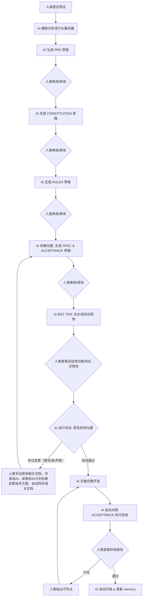
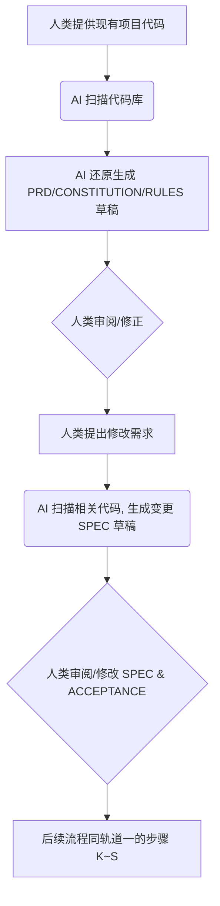

## Vibe Coding 之 SpecFlow 方法论指南

**名称**：SpecFlow（规格驱动工作流）

**口号**：*Write the Spec, Flow with AI.*

> 核心理念：**以结构化文档为唯一事实来源，人类与 AI 协作生成规格，AI 自动对齐执行，人类保留最终验收权。**

---

## SpecFlow 与 Vibe Coding 的关系

“Vibe Coding”一词最初指“不审查 AI 生成的代码，完全依赖氛围构建软件”。

SpecFlow 是 **Vibe Coding 的约束工程学派**。

我们保留了 Vibe Coding 的核心优势：
- 用自然语言快速驱动 AI
- 在探索阶段保持高带宽的思维流动

同时引入了软件工程的纪律：
- 用结构化文档固化“氛围”，使其可追踪、可复用
- 用验收清单和 TDD 确保产出质量
- 用 Git 实现人机协作的变更感知

如果你想要的是“完全放任 AI 写代码，碰运气跑通”——SpecFlow 不适合你。
如果你想要的是“用 AI 加速，但依然能交付生产级软件”——欢迎使用 SpecFlow。

---

### 一、核心理念

| 要素 | 说明 |
| :--- | :--- |
| **文档即中枢** | 所有需求、架构、验收标准均以 Markdown 文档形式存在于项目仓库中，构成唯一事实来源。 |
| **协作生成** | 文档由人类与 AI 共同产出：人类提想法，AI 出草稿，人类修改定稿。 |
| **修改即指令** | 人类对任何文档的修改，即视为对 AI 的最新指令，AI 必须在后续行为中自动对齐。 |
| **AI 驱动执行** | AI 负责根据文档生成测试、代码、验收报告，并执行归档与记忆更新。 |
| **人类保留终裁权** | 人类可随时查看 AI 的执行细节，指出不符之处，打回重做。 |

---

### 二、适用场景

- ✅ 需要长期维护、多人协作的产品级项目。
- ✅ 有明确交付标准和验收要求的商业项目。
- ✅ 有架构经验、希望精准控制交付质量的开发者。
- ⚠️ 快速原型验证、一次性脚本、探索性 Demo：不建议使用“完整 SpecFlow”，但可以使用 **轻量 SpecFlow**（最小验收点 + 最小可复现验证），以避免完全失控的氛围编程。

---

### 三、文件体系（唯一事实来源）

> 本文件体系设计为**工具无关**，适用于 Claude Code、Cursor、OpenCode、GitHub Copilot 等任何支持读取项目文件的 AI 编码工具。

```text
项目根目录/
│
├── .specflow/                          # SpecFlow 中枢目录（统一迁移）
│   ├── AGENTS.md                       # AI 行为准则（每次会话自动加载，部分工具需手动引用）
│   ├── CONSTITUTION.md                 # 项目宪法（不可变最高原则）
│   ├── RULES.md                        # 技术架构与规范（Schema、状态机、分层约束）
│   │
│   ├── docs/
│   │   ├── PRD.md                      # 产品需求全景图
│   │   └── NFR.md                      # 非功能性需求（性能、安全、可观测性）
│   │
│   ├── specs/
│   │   ├── active/                     # 进行中的功能
│   │   │   └── [feature-name]/
│   │   │       ├── SPEC.md             # 需求规格说明书
│   │   │       ├── ACCEPTANCE.md       # 验收标准清单
│   │   │       └── plan.md             # 实施计划（AI 生成，可选）
│   │   └── archive/                    # 已完成归档
│   │       └── [feature-name]/
│   │           ├── SPEC.md
│   │           ├── ACCEPTANCE.md
│   │           └── COMPLETION_REPORT.md
│   │
│   ├── memory/
│   │   ├── progress.md                 # 整体进度追踪
│   │   ├── active_context.md           # 当前聚焦任务与待办
│   │   └── decisions.md                # 架构决策记录（ADR）
│   │
│   ├── scripts/                        # 自动化工具链（可选）
│   │   ├── new-feature.sh
│   │   └── archive-feature.sh
│   └── templates/                      # 文档模板（与 scripts 同级）
│       ├── SPEC_TEMPLATE.md
│       └── ACCEPTANCE_TEMPLATE.md
│
└── tests/                              # 测试用例（AI 生成，人类可修改）
    └── [feature-name]_test.xx
```

---

### 3.1 与 Superpowers 的关系（互补不冲突）

SpecFlow 的定位是 **补充** Superpowers：

- **Superpowers**：提供流程纪律（brainstorming → plan → 执行 → TDD → review → verification）
- **SpecFlow**：提供规格治理（文档即中枢、修改即指令、验收清单、归档与记忆）

两者同时启用时必须做到“绝对不冲突”，因此采用 **双文档体系并存 + 阶段主文档** 的规则。

#### A) 双文档体系并存（分工明确）

SpecFlow 与 Superpowers 的文档产物同时存在，且不强行合并到单一路径：

- `docs/superpowers/specs/**`：设计讨论与取舍（如何做/为什么这么做）
- `docs/superpowers/plans/**`：实施计划（按步骤怎么做）
- `.specflow/**`：交付标准与治理（做什么/做到什么算完成/验收与归档）

#### B) 阶段主文档（谁说了算）

当两套文档对同一问题存在差异时，以当前阶段的“主判定来源”为准：

- **需求澄清/设计阶段**：`docs/superpowers/specs/**` 为主，但必须受 `.specflow/CONSTITUTION.md` / `.specflow/RULES.md` / `.specflow/docs/*` 的约束
- **规格冻结阶段（交付边界）**：`.specflow/specs/active/<feature>/SPEC.md` + `ACCEPTANCE.md` 为主
- **实施阶段**：`docs/superpowers/plans/**` 为主，但不得越过 `.specflow/.../SPEC.md` 的 Non-Goals，并必须覆盖 `.specflow/.../ACCEPTANCE.md`
- **验收/归档阶段**：`.specflow/.../ACCEPTANCE.md` 为主（逐条证据），并生成 `COMPLETION_REPORT.md`、归档与 memory 更新

#### C) 不绕过 Superpowers 的硬门禁

为确保过程纪律不被稀释：

- 在进入实现前：必须先走 `brainstorming` 并获得人类认可
- 任何生产代码变更：必须遵守 `test-driven-development`（先见红后写实现）
- 在宣称“完成/通过/修复”前：必须走 `verification-before-completion`（新鲜证据）

#### D) Feature 关联索引（强制）

为避免“双文档体系”长期维护困难，每个 feature 必须维护索引：

- `.specflow/specs/active/<feature-name>/INDEX.md`

索引至少包含：
- 对应的 `docs/superpowers/specs/**`（设计文档路径）
- 对应的 `docs/superpowers/plans/**`（计划文档路径）
- SpecFlow 的 `SPEC.md` / `ACCEPTANCE.md`
- 当前阶段与主判定来源说明

**文件命名规范：**
- 核心规则文件：大写蛇形命名（`CONSTITUTION.md`, `RULES.md`）。
- 功能级文档：目录使用小写短横线命名（`user-points`），文件大写（`SPEC.md`, `ACCEPTANCE.md`）。
- 动态记忆库：小写蛇形命名（`progress.md`, `active_context.md`）。

---

### 四、内置角色与职责

| 角色 | 触发指令（通用） | 职责 |
| :--- | :--- | :--- |
| **产品经理 (PM)** | `/pm` 或 "请切换到产品经理模式" | 生成 PRD、拆解 SPEC、编写验收清单草稿。 |
| **架构师/开发 (AR)** | `/ar` 或 "请切换到架构师模式" | 生成技术文档、实施计划、TDD 循环、代码实现。 |
| **测试验收 (QA)** | `/qa` 或 "请切换到验收模式" | 执行验收清单、生成报告、归档、更新 memory_bank。 |

> 注：不同 AI 工具的角色切换实现方式不同（如 Claude Code 的 Style、Cursor 的 Rules），具体见落地文档。

---

### 五、双轨工作流

#### 🚀 轨道一：从零开始的新项目



**人类手动介入点：**
- 每个文档草稿生成后，均可直接编辑修改。
- 测试用例生成后，可手动修改以强化边界。
- 验收报告中任何不符，可打回重做。
- 技术选型变更时，手动修改 `.specflow/RULES.md` 或 `.specflow/CONSTITUTION.md`。

#### 🔄 轨道二：现有项目改造（OpenSpec 风格）



---

### 六、操作口令表（工具通用版）

| 场景 | 口令模板 |
| :--- | :--- |
| **初始化项目** | `“/specflow init new（新项目）或 /specflow init old（现有项目）。”` |
| **拆解功能** | `“/pm 根据 .specflow/docs/PRD.md 和宪法，在 .specflow/specs/active/[feature-name]/ 下生成 SPEC.md 和 ACCEPTANCE.md 草稿。”` |
| **开始开发** | `“/ar 阅读 .specflow/specs/active/[feature-name]/SPEC.md，先生成测试用例，通过后执行完整开发，确保验收清单全部满足。”` |
| **执行验收** | `“/qa 请执行验收流程，生成验收报告。”` |
| **指出不符** | `“验收项 X.X 与 ACCEPTANCE.md 不符，具体表现为 [描述]，请修正代码并重新验收。”` |
| **技术变更** | `“我修改了 .specflow/RULES.md 中的 [某部分]，请重新扫描所有相关代码，确保对齐新规范。”` |
| **现有项目** | `“/specflow init old 后，扫描整个项目，还原 .specflow/docs/PRD.md、.specflow/CONSTITUTION.md、.specflow/RULES.md 草稿。然后我将提出修改需求。”` |
| **归档功能** | `“/qa 功能验收通过，请生成完工报告，归档至 .specflow/specs/archive，更新 .specflow/memory。”` |

---

### 七、模板文件

为避免 README 过长，模板已拆分到 `.specflow/templates/`：

- `AGENTS_TEMPLATE.md`（AI 行为准则模板）
- `CONSTITUTION_TEMPLATE.md`（项目宪法模板）
- `RULES_TEMPLATE.md`（技术规范模板）
- `PRD_TEMPLATE.md`（产品需求模板）
- `NFR_TEMPLATE.md`（非功能性需求模板）
- `SPEC_TEMPLATE.md`（功能规格模板）
- `ACCEPTANCE_TEMPLATE.md`（验收清单模板）
- `PROGRESS_TEMPLATE.md`（进度追踪模板）
- `ACTIVE_CONTEXT_TEMPLATE.md`（当前上下文模板）
- `DECISIONS_TEMPLATE.md`（架构决策记录模板，可选）

---

### 八、Superpowers 技能包（自动构建与部署）

本仓库支持将 SpecFlow 方法论封装为可分发的 **Superpowers 技能包**：

- **源码（单一事实来源）**：
  - 技能源码：`skills/`
  - 模板源码：`.specflow/templates/`
- **构建产物**：`superpowers-skills/specflow/`
- **部署目标**：任意项目的 `.superpowers/skills/specflow/`

#### 构建
- Windows（PowerShell）：
  - 运行：`scripts/build-superpowers-skill.ps1`
- macOS/Linux（bash）：
  - 运行：`scripts/build-superpowers-skill.sh`

#### 部署到任意项目
- Windows（PowerShell）：
  - 在目标项目根目录运行：`<此仓库>/install.ps1`
- macOS/Linux（bash）：
  - 在目标项目根目录运行：`<此仓库>/install.sh`

#### 使用
- `/specflow init new`：新项目初始化
- `/specflow init old`：现有项目初始化
- `/specflow <需求>`：直接进入工作流编排
- `/pm` `/ar` `/qa`：角色分工执行闭环

> 注：上述“口令”是跨工具通用的 **语义触发方式**。在 Cursor 中可以通过插件命令映射实现真正的内置命令；未实现映射前，仍可通过自然语言或以“/xxx”开头的文本触发同等语义流程。
